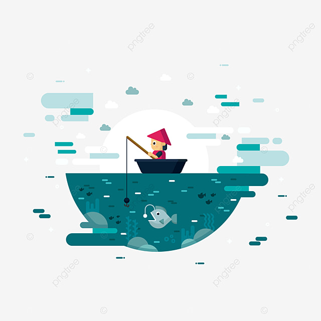

 

This was a project that culminated over the course of ICS 211 at KCC during the spring semester of 2022. It was an exercise to work with a team and do code reviews, while coding to meet specific criteria given by the instructor. 

The game takes place over a simulated year, indicated by each month of the year (January, February, etc.). Fish are filled into an array and players take turns, prompting them to fish from the pond with variable rates of catching a fish (3 attempts each per month). A fish is returned with additional information detailing the fish’s species and size. Players are prompted to either keep the fish or throw the fish back into the pond. Different species of fish have legal sizes and seasons in which they can be kept. A player who decides to keep a fish that is not within the legal size range or is caught out of the fishing season for that particular fish is punished by having their entire bucket of fish emptied. The game ends when the twelve months are over and the number of fish in each bucket are compared. The player with more fish in the bucket is declared the winner.

This program was a great exercise to flex our Java skills that we were developing over the course of the previous year and allowed us to implement a tangible program with a function. It also allowed us to work in groups, for better or worse, and got us acclimated to reviewing one another's code and giving feedback/help where applicable.

[Fish Game](https://github.com/Ssunoo2/Fishing-Game)
