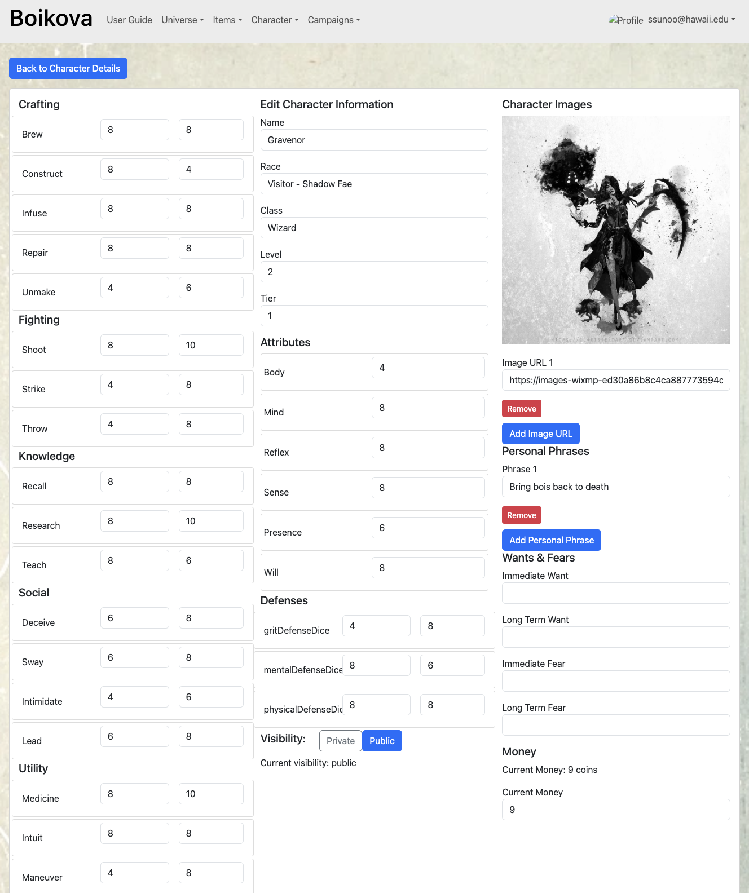
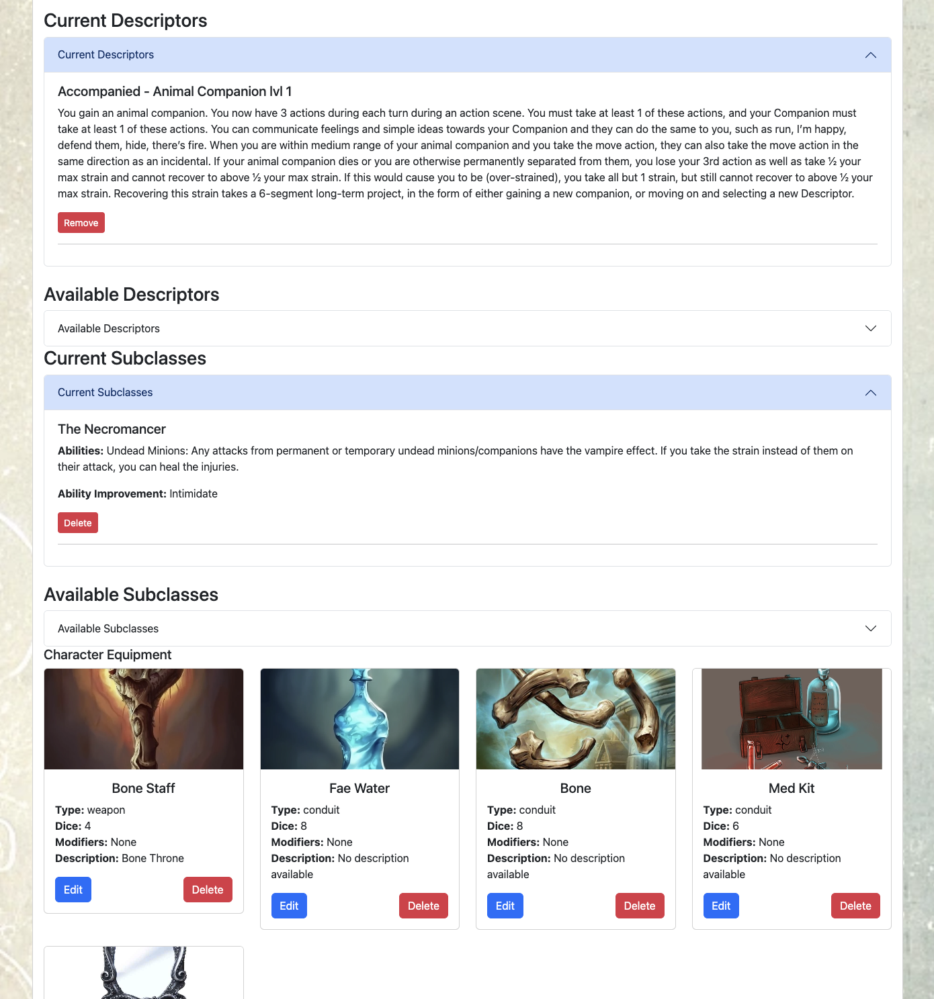
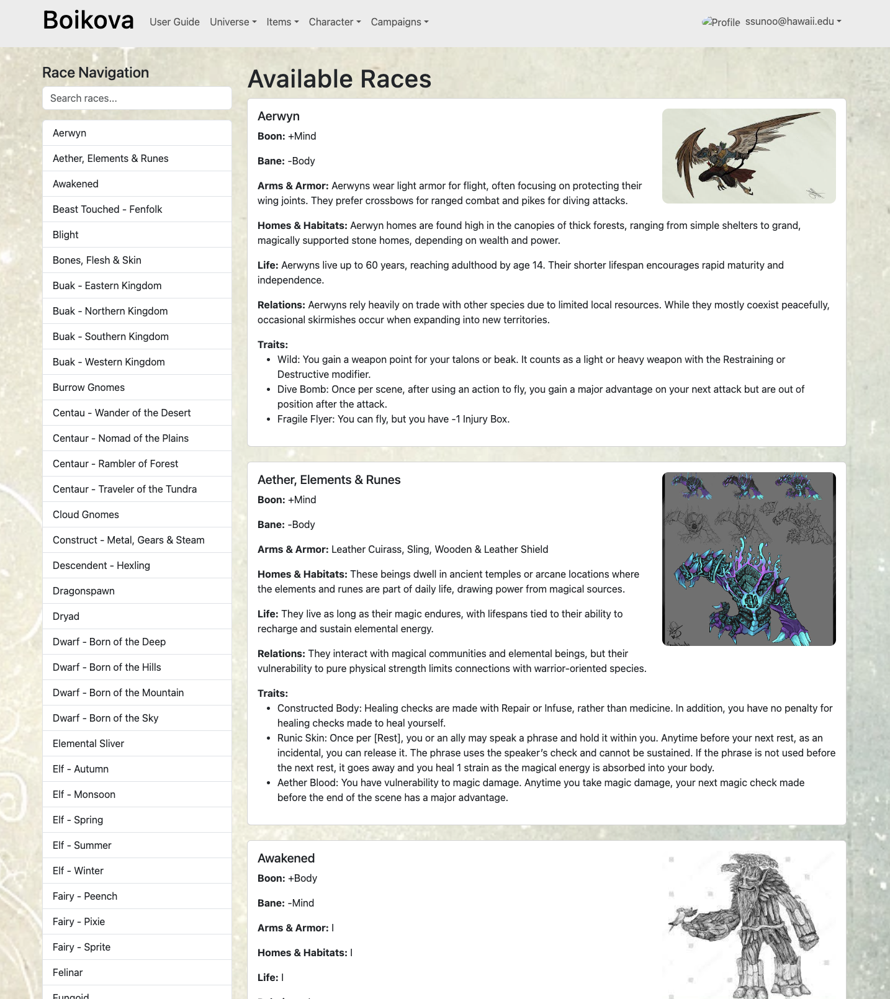

## RPG Management Platform

[RPG Management Platform](https://www.manafestdestiny.com/) is a fully interactive web application designed to bring a custom-built tabletop RPG universe to life. This project catalogs game rules, classes, races, items, and other RPG elements, dynamically rendered from JSON files. Registered users can create accounts to build and edit custom characters with attributes, stats, and equipment.

The project demonstrates proficiency in front-end and back-end development using **React** and **Meteor**, as well as database management with **MongoDB**. Real-time updates via Meteor's reactive data system ensure seamless character management and gameplay support. Additional skills such as UI design, authentication implementation, and JSON data manipulation were integral to the creation of this app.

### Key Features
- **Dynamic Game Data**: Game rules, classes, races, and items are rendered dynamically from JSON files into structured pages.  
- **Character Management**: Users can create accounts, build custom characters, and edit stats, attributes, and inventory.  
- **Real-Time Updates**: Leveraged Meteor's reactive data system for instant updates to character data and game changes.  
- **User Authentication**: Secure login system to protect user accounts and data.  
- **Responsive Design**: Built with React and styled with Semantic UI for an intuitive user experience.

Here are screenshots from the project:

  
  
  

Check out the live application below!  
[RPG Management Platform](https://www.manafestdestiny.com/)
