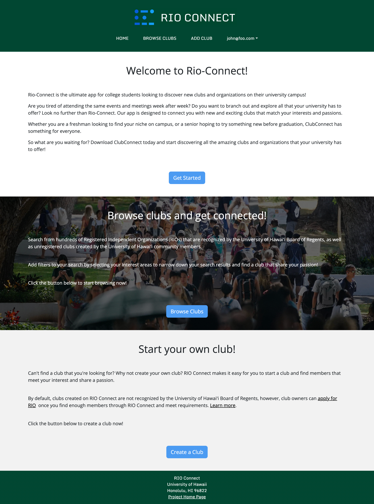

## Rio-Connect

Rio Connect is a web based application that catalogs the registered independent organizations (RIOs) at the University of Hawaii at Manoa and facilitates club discovery. Students can create accounts and browse by club type corresponding to their particular interests and join the clubs of their choosing, accessing club information such as leadership contacts and overall club descriptions. 

The creation of the app allowed practice with synchronizing front-end with back-end development as well as database management. Monitoring via application testing and performance via Monti APM were also important as were deployment through Digital Ocean. Agile project management allowed successful delegation and execution of issues and facilitated communication with the team alongside bi-weekly meetings. 

Here is an image from our landing page

  

Check out our homepage below!

[rio-connect.github.io](https://rio-connect.github.io/)
