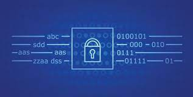

We did this project in our 212 class for our final project and it was written as the culmination of our C programming language knowledge. It was a solo project and involved many functions as well as bitwise operators to generate a digest given an input. 

Sha-1 (Secure has Algorithm 1) is a cryptographic hashing function that returns a fixed size string of characters, which is a "digest" of an input. The typical digest is a 40 hexadecimal character string. SHA-1 was implemented as a security standard for a long time due to the replicating the digest result given an input or the input give a digest result to computationally infeasable. SHA-1 has been retired in recent years given the technological advancements in cybersecurity and cryptography, rendering these previously computationally infeasible problems to become theoretically possible. Cybersecurity experts have graduated to stronger hash functions such as SHA-256 or SHA-3. 

This project was very educational as it allowed me to practice my C coding knowledge up to that point. I distinctly remember being intimidated by bitwise operators, but then spending most of my time figuring out to translate an input into something C readable.
